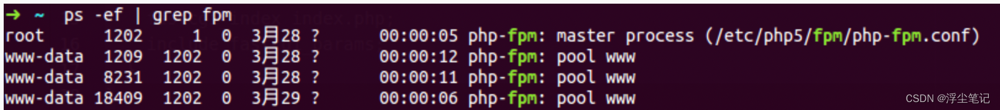
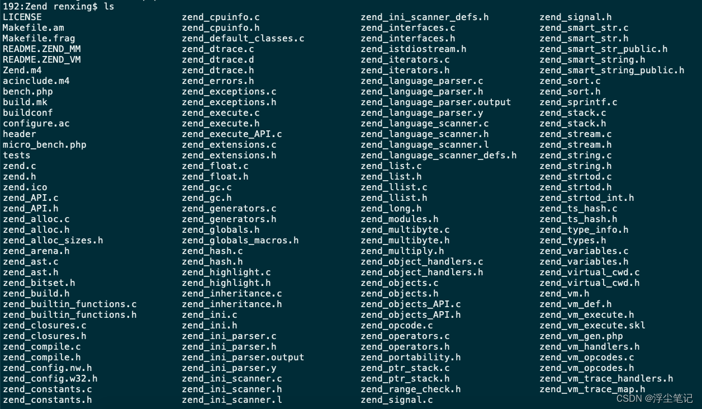
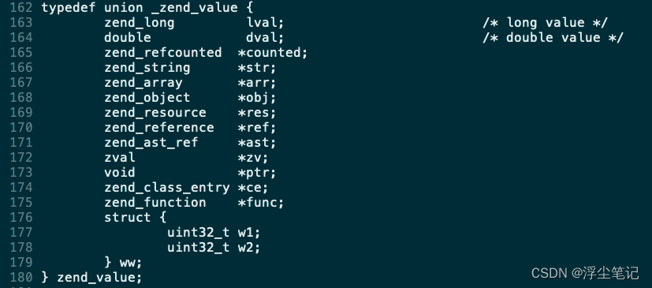

# 关于php-fpm
**cgi**：common gateway interface（通用网关接口），是一种网络通信协议，它允许 web 服务器通过特定的协议与应用程序通信，调用原理如下：
> 用户请求 -> Web 服务器接收请求 -> fork 子进程 调用程序 / 执行程序 -> 程序返回内容 / 程序调用结束 -> Web 服务器接收内容 -> 返回给用户。

**fast-cgi**：允许在一个进程内处理多个请求，而不是一个请求处理完毕就直接结束进程，性能上有了很大的提高。调用过程如下：
> Web 服务器 Fast-CGI 进程管理器初始化 -> 预先 fork 多个进程用户请求 -> Web 服务器接收请求 ->Web 服务器将请求交给 Fast-CGI 进程管理器 ->Fast-CGI 进程管理器接收，给其中一个空闲的的 Fast-CGI 进程处理 -> 处理完成 Fast-CGI 进程变为空闲状态，等待下次请求 ->Web 服务器接收内容 -> 返回给用户。

**fpm**：FastCGI Process Manager，是 FastCGI 的实现，任何实现了 FastCGI 协议的 Web Server 都能够与之通信。

**php-fpm**：php FastCGI Process Manager，是一个 PHP 进程管理器，包含 master 进程和 worker 进程两种进程：master 进程只有一个，负责监听端口，接收来自 Web Server 的请求，而 worker 进程则一般有多个 (具体数量根据实际需要配置)，每个进程内部都嵌入了一个 PHP 解释器，是 PHP 代码真正执行的进程，如下图，1个 master 进程，3个 worker 进程：


Nginx 提供了 fastcgi 模块来将 http 请求映射为对应的 fastcgi 请求，Nginx 的 fastcgi 模块提供了 fastcgi_param 指令来主要处理这些映射关系，fastcgi_pass 指令用于指定 fpm 进程监听的地址。配置nginx.conf 支持php-fpm，当请求php文件的时候，反向代理到php-fpm：
```
location ~ \.php$ {       
    include /usr/local/etc/nginx/fastcgi.conf; #加载nginx的fastcgi模块
    fastcgi_intercept_errors on;       
    fastcgi_pass   127.0.0.1:9000; #nginx fastcgi进程监听的IP地址和端口
}
```

> nginx与php-fpm的结合，完整的流程是这样的：
> * 用户在浏览器器中输入 www.example.com
> * 请求到达 nginx
> * 路由到 www.example.com/index.php
> * 加载nginx的fast-cgi模块
> * fast-cgi监听127.0.0.1:9000地址
> * www.example.com/index.php 请求到达 127.0.0.1:9000
> * php-fpm 监听127.0.0.1:9000
> * php-fpm接收到请求，启用worker进程处理请求
> * php-fpm处理完请求，返回给nginx
> * nginx将结果通过http返回给浏览器


# PHP变量的底层实现
PHP是用C语言开发的，C语言是强类型的,而PHP是弱类型语言，那么底层是如何实现的?

解压 php-7.3.18 的源码包，进入Zend目录可以看到如下内容：

Zend目录是Zend虚拟的实现，包括栈、数据类型、编译器等，都在这里实现。

PHP变量是通过zval结构体来存储的，打开 zend_types.h 文件，找到 _zend_value 部分：



上面对不同类型的变量的说明如下：
``` c
typedef union _zend_value {
        zend_long         lval; // 整型(长度8字节)
        double            dval; // 浮点型(长度8字节)    
        zend_refcounted  *counted; // 引用计数(长度8字节)
        zend_string      *str; // 字符串类型(长度8字节)
        zend_array       *arr; // 数组(长度8字节)
        zend_object      *obj; // 对象(长度8字节)
        zend_resource    *res; // 资源型(长度8字节)
        zend_reference   *ref; // 引用型(长度8字节)
        zend_ast_ref     *ast; //抽象语法树(长度8字节)
        zval             *zv; // zval类型(长度8字节)
        void             *ptr; // 指针类型(长度8字节)
        zend_class_entry *ce; // class类型(长度8字节)
        zend_function    *func; // function类型(长度8字节)
        struct {
                uint32_t w1;
                uint32_t w2;
        } ww;
} zend_value;
```
> PHP脚本解释执行的机制：
1、php初始化执行环节，启动Zend引擎，加载注册的扩展模块
2、初始化后读取脚本文件，Zend引擎对脚本文件进行词法分析(lex)，语法分析(bison)，生成语法树
3、Zend 引擎编译语法树，生成opcode，
4、Zend 引擎执行opcode，返回执行结果


# PHP的垃圾回收机制
PHP可以自动进行内存管理，清除不再需要的对象，主要使用了引用计数。每个对象都内含一个引用计数器，每个reference链接到对象，计数器加1，当reference离开生存空间或者被设为null,计数器减1，当某个引用计数器的对象为0时，PHP知道你将不再需要使用这个对象，释放其所占有的内存空间。

> 在zval结构体中定义了ref_count和is_ref , ref_count是引用计数 ,标识此zval被多少个变量引用 , 为0时会被销毁。is_ref标识是否使用的 &取地址符强制引用。

细节分析：

* 每个变量会有refcount用来表示有 多少变量指向它,当它是0的时候那么* 这个变量就是垃圾；
* 在PHP5.3 之前PHP都是通过判断 refcount 来清除垃圾对象的；
* 在PHP5.3 之后, php又增加了算法来解决循环引用的问题，判断循环引用中refcount达到10000次就自动进行回收。